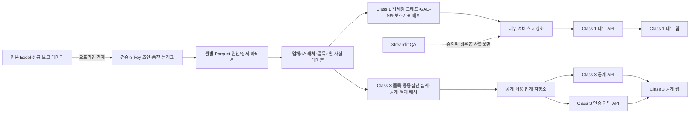

# 목표 웹 아키텍처

> 상태: 제품·기술 기준선(implementation baseline)
> 기준일: 2026-08-11
> 적용 범위: Class 1 내부 모니터링 웹, Class 3 공개·인증 기업 웹, 공통 오프라인 데이터 파이프라인
> 비범위: 이 문서는 패키지 선정 확정, 설치, 배포, 모델 학습을 수행하지 않는다.

## 결정 표기

- **Confirmed fact**: 저장소 코드나 저장소의 생산 방문 문서로 확인한 사실
- **Locked decision**: 다음 구현이 따라야 하는 제품·기술 결정
- **Proposed decision**: 권장안이며 구현 착수 전에 기술 검증이 필요한 선택
- **Decision required**: 제품 책임자 또는 NIDS의 명시적 답이 필요한 항목
- **Implementation risk**: 그대로 구현하면 정확성·보안·성능 문제가 생길 수 있는 조건

## 현재 기준선

- **Confirmed fact** — 생산 방문 기준 공급 데이터는 4개월 약 1,200만 행, 마스터는 약 262.6만 행이며, 보유 공급 기간은 2020-08부터 2026-04까지다. 생산 3-key 조인율은 99.97%다. 근거: [`shared_docs/structured/onsite_visit1_summary.md`](../../shared_docs/structured/onsite_visit1_summary.md).
- **Confirmed fact** — 로컬 top7은 공급 704,315행, 70개월, 7개 품목 중심의 표본이다. 생산 대표성을 주장할 수 없다. 근거: [`prototype_meeting/research/platform_benchmark.md`](../../prototype_meeting/research/platform_benchmark.md).
- **Confirmed fact** — 현재 Class 1/3 Streamlit 앱은 웹 요청 시 Excel을 읽지 않고 사전 계산 CSV를 읽는다. Excel은 `src/ingest/loader.py`를 호출하는 배치·EDA 경로에서 읽는다.
- **Confirmed fact** — 저장소에는 Parquet 적재, 서비스 API, 인증·권한 계층, PostgreSQL/ClickHouse/Redis 연동, 공개 억제 서비스가 없다.
- **Implementation risk** — `shared_data/DATA_LAYER.md`의 “큰 파일은 chunked reads” 요구와 달리 현재 Excel 로더는 `pandas.read_excel`로 전체 시트를 메모리에 적재한다.

## 목표 구조



## 고정된 경계

1. **Locked decision** — 원시 Excel은 HTTP 요청 처리 중 읽지 않는다.
2. **Locked decision** — 정제 데이터는 월별 Parquet 파티션을 표준 분석 계층으로 둔다.
3. **Locked decision** — 공통 최소 사실 단위는 `업체×거래처×품목×월`이다.
4. **Locked decision** — GAD-NR, BC, 가격 z-score, 시간 단차와 공개 집계는 오프라인 배치에서 산출한다. API 요청이 학습이나 전체 그래프 계산을 시작해서는 안 된다.
5. **Locked decision** — Class 1 내부 API와 Class 3 공개 API는 배포 단위, 자격 증명, 데이터베이스 역할, 응답 필드 allowlist를 분리한다.
6. **Locked decision** — 인증 기업 기능도 공개 API의 단순 플래그가 아니라 별도 인증 경계와 쿼리 정책을 가진다.
7. **Locked decision** — Streamlit은 필요하면 내부 QA·모델 실험 도구로만 유지한다. 공개 또는 정식 내부 서비스의 프런트엔드가 아니다.
8. **Locked decision** — 브라우저에는 원시 행, 전체 네트워크, 직접 식별자, 모델 입력 텐서를 전달하지 않는다.

## 공통 사실 테이블 계약

논리 이름: `fact_company_counterparty_product_month`

| 필드 | 형식 | 계약 |
|---|---|---|
| `month` | `YYYYMM` | 파티션 키, 공급내역기준연월 |
| `src_company_id` | string | 내부 안정 업체 ID; 공개 API 출력 금지 |
| `dst_company_id` | string | 내부 안정 거래처 ID; 공개 API 출력 금지 |
| `product_id` | string | 정규화되고 완전한 3-key 기반 내부 제품 키 |
| `item_group_id` | string/null | 품목군 검색·집계 키; 결측 여부 보존 |
| `item_name_id` | string/null | 품목명 검색·집계 키; 품목군과 혼용 금지 |
| `tx_count` | integer | `(source_version, source_row_id)` 중복 제거 후 보고·거래 행 건수 |
| `amount_sum_clean` | decimal | 정제된 공급금액 합계 |
| `amount_valid_row_count` | integer | 금액 유효률 계산용 분모 정보 |
| `raw_supply_qty_sum` | decimal | 원본 공급수량 합계 |
| `piece_qty_sum` | decimal/null | 포장내 총 수량을 반영한 낱개 수량 합계 |
| `raw_supply_qty_valid_row_count` | integer | 원본 공급수량 유효률 계산용 |
| `piece_qty_valid_row_count` | integer | 낱개 수량 유효률 계산용 |
| `unique_udi_count` | integer | 제품 다양성 보조 사실 |
| `active_day_count` | integer | 월내 활동 지속성 |
| `supplier_type`, `receiver_type` | code/null | 역할·업종 구성 집계용 |
| `supplier_region`, `receiver_region` | broad code/null | 광역 지역 집계용 |
| `source_version` | string | 원천 파일/적재 배치 버전 |
| `quality_flags` | array/string | 조인, 금액 대체, 결측 등 품질 상태 |

- **Locked decision** — `tx_count`, `amount_sum_clean`, `raw_supply_qty_sum`, `piece_qty_sum`은 서로 다른 단위이므로 합성 `weight`로 더하지 않는다.
- **Locked decision** — 금액·수량 합계와 함께 유효 행 수 또는 유효률을 저장한다.
- **Decision required** — `piece_qty_sum`의 공식은 `공급수량 × 포장내 총 수량`을 권장하지만, 반품·회수·부분 낱개 회수와 UDI 포장단위 예외를 NIDS가 승인해야 한다.
- **Implementation risk** — 품목군이 결측일 때 품목명을 품목군으로 대체하는 현재 Class 3 로직은 분류 체계를 섞는다. 목표 계약은 둘을 분리하고 `unknown`/결측을 명시한다.

### 집계 전 식별·중복·부호 계약

- **Locked decision** — `product_id`를 만들기 전에 3-key 각 값을 공식 필드형에 따라 정규화한다. 앞뒤 공백과 정수형 코드의 문자열/숫자 dtype 차이를 제거하되, 사전 정의 없이 일반 문자열의 선행 0을 버리지 않는다.
- **Locked decision** — 정규화된 3-key 튜플을 길이 구분이 가능한 직렬화 형식으로 만든 뒤 안정 해시를 계산한다. 동일한 공식 코드가 공백이나 dtype 차이 때문에 다른 `product_id`가 되어서는 안 된다.
- **Locked decision** — 3-key 구성요소 중 하나라도 null, 빈 문자열, 비정상 값이면 정상 `product_id`를 만들지 않고 `blocked:product_key_invalid`로 격리한다.
- **Locked decision** — 집계 입력 행은 `source_version`과 원천 내 불변 `source_row_id`를 가져야 하며, `(source_version, source_row_id)`를 멱등 키로 중복 제거한 뒤에만 `tx_count`와 합계를 계산한다. 원천 행 ID는 집계 사실이나 서비스 응답에 노출하지 않는다.
- **Locked decision** — 원천 식별자가 없을 때의 책임은 원본 적재 adapter에 있다. 승인된 불변 레코드 키나 파일 내 행 위치로 재현 가능한 ID를 만들 수 없으면 manifest를 `blocked:deduplication_unverified`로 기록하고 월 사실을 산출하지 않는다.
- **Locked decision** — 일반 공급 거래에서 음수 금액·원본 수량·낱개 수량은 합산하지 않고 `blocked:negative_forward_value` 오류 또는 품질 차단 상태로 처리한다.
- **Locked decision** — 반품·회수는 거래 구분별 부호 정책이 승인되기 전 월 사실에 집계하지 않고 `blocked:transaction_sign_policy_pending`으로 분리한다.

## 분석 계층 분리

### Class 1

- 모델 그래프: 앵커 3개월, 업체쌍당 방향성 간선 1개.
- 제품 세부: 위 사실 테이블에서 기간·업체쌍별 상위 품목을 조회한다.
- 모델 결과: 모델 버전, 앵커, 역할군, 역할군 백분위, 검토 우선순위.
- 보조지표: BC, 가격 z-score, 시간 단차, 관계 diff. 모델 입력과 분리한다.

### Class 3

- 공개 데이터 제품: 억제·비식별 처리가 끝난 품목/품목군/동종집단 집계만 저장한다.
- 인증 기업 데이터 제품: 검증된 자사 ID와 익명 동종집단 통계의 비교 결과만 반환한다.
- 공개 웹에서 업체 A와 업체 B의 실명 비교를 제공하지 않는다.

## API와 권한

| 경계 | 인증 | 허용 데이터 | 금지 데이터 |
|---|---|---|---|
| Class 1 내부 API | 조직 SSO/RBAC 필요 | 업체 식별자, 내부 네트워크, 검토 우선순위, 보조지표 | 원시 행 다운로드, 요청 시 모델 학습 |
| Class 3 공개 API | 비인증·rate limit | 승인된 집계, 범위값, 억제 상태, 결측 안내 | 업체명, 사업자번호, 업체별 정확값·순위, 원시 경로 |
| Class 3 인증 기업 API | 기업 계정+자사 소유권 검증 | 자사 요약, 익명 동종집단 비교 | 타사 식별값, 소수집단 역추론 가능 값 |

- **Decision required** — SSO/기업 인증 공급자, 역할 체계, 감사로그 보존기간.
- **Decision required** — 공개 최소 셀 크기, 우세도 규칙, 보완 억제, 반올림·구간화, 차분 공격 방지 정책. 기존 `k >= 5`는 프로토타입 기본값이지 법적 안전선이 아니다.

## 기술 선택과 대안

### 프런트엔드

- **Locked decision** — Class 3 최종 웹은 React, Vite, TypeScript `strict` 모드로 구현하며 대상 경로는 `web/class3_public/`이다. 패키지 관리자는 npm, lockfile은 `package-lock.json`으로 고정한다. 세부 근거와 구현 gate는 [Class 3 웹 기술 스택 결정](../decisions/class3-web-stack.md)을 따른다.
- **Locked decision** — PR-C3-UI-01A는 라우터 없는 정적 웹 셸로 시작하고 CSS Custom Properties와 일반 CSS 또는 CSS Modules를 사용한다. Tailwind, UI component kit, 전역 상태관리, 차트 라이브러리는 필요성이 확인될 때까지 도입하지 않는다.
- **Locked decision** — mock fixture는 개발 전용 adapter로 격리한다. production build 또는 runtime이 mock 결과로 자동 fallback해서는 안 되며, 실제 API는 PR-C3-04와 PR-C3-UI-02에서 연결한다.
- **Locked decision** — `prototype_meeting/innovation/class3.*`는 시각 참고 자료일 뿐 신규 웹의 runtime dependency가 아니다. 기존 단일 품목 흐름, 기업군 3단계 wizard, 진단 문장, 성장×HHI 기회지도는 이전하지 않는다.
- **Locked decision** — 현재 Class 3에는 Next.js를 채택하지 않는다. 초기 범위에 SSR, SEO, 서버 컴포넌트, 다중 route 요구가 없고 API 경계가 분리된 대시보드형 SPA이므로 서버 runtime과 캐시 운영 복잡성을 추가하지 않는다. 공개 SEO 또는 서버 렌더링 요구가 확정되면 별도 ADR로 재평가한다.
- **Locked decision** — 전체 데이터 크기는 프런트엔드가 아니라 오프라인 집계, 공개 API 응답 제한, 캐시, 페이지네이션으로 처리한다.
- **Decision required** — 최소 지원 Node.js와 npm 버전은 실제 PR-C3-UI-01A 생성 시 Vite 공식 지원 범위와 CI·배포 환경을 확인해 고정한다. 이 결정은 Class 1 프런트엔드 기술을 확정하지 않는다.

### API

- **Proposed decision** — 기존 Python 분석 계약과 타입 모델을 재사용하기 위해 FastAPI를 기본 후보로 한다. 프로세스 복제·컨테이너 배포 전략을 별도로 설계해야 한다. 공식 근거: <https://fastapi.tiangolo.com/deployment/server-workers/>.
- 대안: Django/DRF는 관리자·ORM·인증 통합이 우선일 때, 조직 표준 Java/.NET API는 운영 인력과 통제가 우선일 때 적합하다.
- **Decision required** — 인증 통합과 운영 표준을 확인하기 전 FastAPI를 확정·설치하지 않는다.

### 저장소

- **Locked decision** — 월별 Parquet은 분석·재현 계층이다. Parquet은 대량 저장·조회에 적합한 열 지향 형식이다. 공식 근거: <https://parquet.apache.org/docs/overview/>.
- **Proposed decision** — 서비스 집계는 PostgreSQL로 시작한다. 관계·권한·검색 메타데이터와 월 파티션을 한 운영 계층에서 다루기 쉽다. 공식 파티셔닝 근거: <https://www.postgresql.org/docs/current/ddl-partitioning.html>.
- **Proposed decision** — 필터 조합과 동시 분석 쿼리가 PostgreSQL SLO를 반복적으로 넘을 때 ClickHouse를 평가한다. ClickHouse는 열 지향 OLAP DB다. 공식 근거: <https://clickhouse.com/docs/get-started/about/intro>.
- **Proposed decision** — Redis는 정확한 TTL·무효화 키가 정의된 반복 조회 캐시에만 추가한다. 첫 배포의 필수 구성요소가 아니다.
- 대안: 개발·배치 QA에서는 DuckDB가 Parquet의 projection/filter pushdown 검증에 유용하지만 다중 사용자 서비스 DB로 간주하지 않는다. 공식 근거: <https://duckdb.org/docs/stable/data/parquet/overview>.

## 서비스 SLO 초안

- **Proposed decision** — 검색 p95 500ms, 집계 조회 p95 1.5s, 가지형 2-hop p95 2s를 초기 목표로 둔다.
- **Proposed decision** — API 응답은 기본 100개 이하의 노드/행으로 제한하고 명시적 페이지네이션을 사용한다.
- **Decision required** — 예상 동시접속, 가용성, 데이터 갱신 주기, 재해복구 목표가 없어 SLO는 아직 확정할 수 없다.

## 목표 파일 경계

구현 시 다음 경계를 권장한다. 경로는 **Proposed decision**이며 이번 단계에서는 생성하지 않는다.

```text
data_pipeline/
  contracts/                 # 공통 스키마·품질 규칙
  ingest/                    # Excel/신규 보고 데이터 -> 월별 Parquet
  aggregates/                # 업체×거래처×품목×월 및 공개 집계
  jobs/                      # 배치 진입점·버전·manifest
services/
  class1_internal_api/       # 내부 전용 API·RBAC
  class3_public_api/         # 공개 allowlist·억제 결과 전용
  class3_enterprise_api/     # 인증 기업·자사 검증
web/
  class1_internal/           # 내부 웹
  class3_public/             # 공개+인증 사용자 웹 셸
schemas/
  openapi/                   # 버전 고정 API 계약
tests/
  contracts/ security/ e2e/
```

## 아키텍처 완료 조건

- API 프로세스에서 `.xlsx`를 여는 코드 경로가 정적 검사와 통합 테스트에서 0건이다.
- 동일 입력과 `source_version`으로 월별 Parquet·집계·모델 결과를 재현할 수 있다.
- Class 1 자격 증명으로 Class 3 비공개 데이터에, 공개 자격으로 Class 1 데이터에 접근할 수 없다.
- 공개 응답 스키마가 allowlist 테스트를 통과하고 억제 사유·결측률·기간을 항상 포함한다.
- 모델/지표 버전이 없는 결과는 서비스하지 않는다.
- Streamlit 중단이 정식 웹 서비스 가용성에 영향을 주지 않는다.

## 관련 문서

- [Class 1 GAD-NR 특징 계약](../decisions/class1-gadnr-feature-contract.md)
- [Class 3 재구축 결정](../decisions/class3-rebuild-decision.md)
- [Class 3 웹 기술 스택 결정](../decisions/class3-web-stack.md)
- [Streamlit 전환 계획](../migration/streamlit-to-web-plan.md)
- [구현 로드맵](../migration/implementation-roadmap.md)
